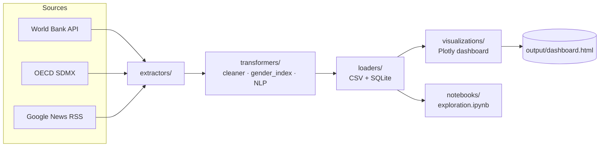

<div align="center">

# 🌍 Gender Equality Tracker

**An end-to-end Python data pipeline that turns public data into an interactive story about gender equality.**

[](https://github.com/PaulaCervilla/gender-equality-tracker/actions/workflows/ci.yml)
[](https://www.python.org/)
[](https://plotly.com/python/)
[](https://opensource.org/licenses/MIT)
[](https://github.com/psf/black)

*World Bank · OECD · Live news · NLP · Composite scoring · Interactive dashboard*

### 👉 [**View the live interactive dashboard**](https://paulacervilla.github.io/gender-equality-tracker/output/dashboard.html)

</div>

---

## ✨ What this project does

It pulls public gender-equality data from **three independent sources**, computes a **composite Gender Equality Score** for every country, runs **sentiment analysis** on live news headlines, and ships everything as a single polished **interactive HTML dashboard** + a narrative **Jupyter notebook**.

It demonstrates, in one repository:

| Skill | Where to look |
|---|---|
| 🛠 Data engineering / ETL | [`src/extractors/`](src/extractors/) — REST + RSS clients with retry/back-off |
| 🌐 Web scraping | [`src/extractors/news_scraper.py`](src/extractors/news_scraper.py) — Google News RSS via BeautifulSoup |
| 🧹 Data wrangling | [`src/transformers/cleaner.py`](src/transformers/cleaner.py) — ISO normalisation, pivoting, latest snapshots |
| 📐 Composite indicator design | [`src/transformers/gender_index.py`](src/transformers/gender_index.py) — min-max scaling, weighted average |
| 🤖 NLP | [`src/transformers/nlp_analyzer.py`](src/transformers/nlp_analyzer.py) — VADER sentiment |
| 📊 Visualisation | [`src/visualizations/dashboard.py`](src/visualizations/dashboard.py) — branded Plotly theme + responsive HTML |
| 🗄 Persistence | [`src/loaders/storage.py`](src/loaders/storage.py) — CSV + SQLite |
| 🧪 Testing | [`tests/`](tests/) — pytest with mocked APIs |
| 🚀 CI/CD | [`.github/workflows/ci.yml`](.github/workflows/ci.yml) — multi-version test matrix |

---

## 🏗️ Architecture



---

## 🚀 Quick start

```bash
git clone https://github.com/PaulaCervilla/gender-equality-tracker.git
cd gender-equality-tracker

# create & activate a virtualenv
python -m venv .venv
source .venv/bin/activate            # macOS / Linux
# .venv\Scripts\activate             # Windows PowerShell

pip install -r requirements.txt

# Run the full ETL + dashboard
python -m src.pipeline

# Open the dashboard
open output/dashboard.html           # macOS
# start output\dashboard.html        # Windows
# xdg-open output/dashboard.html     # Linux
```

> No API keys required — every data source is public.

---

## 📊 What you get

### Interactive dashboard — [**view live**](https://paulacervilla.github.io/gender-equality-tracker/output/dashboard.html) · [source](output/dashboard.html)

A single self-contained, responsive HTML file with:

- 🎨 Gradient hero header + KPI strip (countries scored, mean score, top country, avg wage gap)
- 🌍 **Choropleth world map** — composite Gender Equality Score
- 💼 **Wage-gap bar chart** — OECD ranking with inline labels
- 📰 **Sentiment donut** — distribution of news-headline tone
- 📈 **Faceted line chart** — male vs female labor participation across 8 economies (one solid line per country, side-by-side panels)
- 🎓 **Bubble scatter** — female literacy × labor participation, sized by women in parliament
- 🗞 **Combo chart** — daily headline volume (bars) and sentiment (line)

### Narrative notebook ([`notebooks/exploration.ipynb`](notebooks/exploration.ipynb))

A guided walkthrough with **5 data-driven findings**, each pairing a styled dataframe / chart with a short interpretation:

1. 🏆 Who leads and who lags on gender equality
2. 🎓 Whether education translates into workforce participation
3. 🏛 How fast women's political representation is growing
4. 📰 What tone media coverage takes on the topic
5. 💼 Where the wage gap is widest and narrowest

---

## 📦 Project layout

```
gender-equality-tracker/
├── config.py                      # API endpoints, indicator codes, weights
├── src/
│   ├── extractors/
│   │   ├── http_client.py         # Retry/back-off HTTP helper
│   │   ├── worldbank.py           # World Bank Indicators API
│   │   ├── oecd.py                # OECD SDMX (with embedded fallback)
│   │   └── news_scraper.py        # Google News RSS · BeautifulSoup
│   ├── transformers/
│   │   ├── cleaner.py             # ISO 3166 filter · pivot · latest snapshot
│   │   ├── gender_index.py        # Min-max scaling + weighted score
│   │   └── nlp_analyzer.py        # VADER sentiment on headlines
│   ├── loaders/
│   │   └── storage.py             # CSV + SQLite persistence
│   ├── visualizations/
│   │   └── dashboard.py           # Branded Plotly theme + responsive HTML
│   └── pipeline.py                # End-to-end orchestrator
├── notebooks/
│   └── exploration.ipynb          # 5-finding narrative walkthrough
├── tests/                         # pytest unit tests (mocked APIs)
├── output/dashboard.html          # Generated by the pipeline
├── data/                          # CSV + SQLite outputs (gitignored)
├── requirements.txt
├── README.md
└── .github/workflows/ci.yml       # CI on push / PR (Python 3.10/3.11/3.12)
```

---

## 🧪 Tests

```bash
pytest -v
```

All network calls are mocked, so the suite runs offline in seconds. Coverage spans:

- World Bank API JSON parsing (happy path + empty payloads)
- Google News RSS parsing (BeautifulSoup with `lxml-xml`)
- ISO 3166 country filtering (drops aggregates like *World*, *Euro area*)
- Long → wide pivot
- Composite Gender Equality Score is bounded to [0, 100]
- VADER sentiment labelling

---

## 🔬 Data sources & methodology

| Source | What we use | Endpoint |
|---|---|---|
| **World Bank Indicators API** | 12 gender-relevant indicators (labor participation, literacy, parliament seats, school enrolment GPI, life expectancy, …) for 2000-2023 | `https://api.worldbank.org/v2/` |
| **OECD SDMX REST** | Gender wage gap (`DSD_EARNINGS@GENDER_WAGE_GAP`) | `https://sdmx.oecd.org/public/rest/` |
| **Google News RSS** | Live headlines for 4 gender-equality search queries | `https://news.google.com/rss/search` |

The composite score uses **min-max normalisation + weighted average** across 6 sub-components (see [`config.GENDER_INDEX_COMPONENTS`](config.py)). When a country is missing values the weights of present components are renormalised, so partial coverage degrades gracefully.

The OECD extractor ships with an **embedded snapshot fallback**: if the live endpoint is unreachable (corporate proxy, SSL inspection, downtime…), the pipeline still produces output instead of failing.

---

## 🛠 Tech stack

`requests` · `pandas` · `BeautifulSoup4` (lxml-xml) · `Plotly` · `vaderSentiment` · `pycountry` · `tqdm` · `pytest` · `Jinja2` · `nbformat`

---

## 🌱 Ideas for future work

- Add a **time-series animation** of the choropleth (year slider)
- Train a small **topic model** (BERTopic) on the scraped headlines instead of a bag-of-words sentiment score
- Layer on **UN SDG-5** indicators for cross-validation of the composite score
- Replace SQLite with **DuckDB** for faster analytical queries on the long-format frame

---

## 📝 License

MIT — built for portfolio / educational purposes. Data is © its respective publishers; please consult their terms for re-use.
